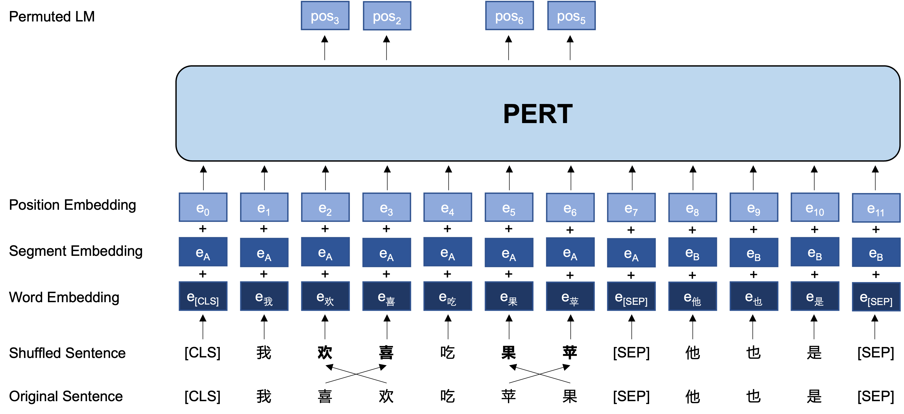

[**中文**](https://github.com/ymcui/PERT/) | [**English**](https://github.com/ymcui/PERT/blob/main/README_EN.md)

<p align="center">
    <br>
    
    <br>
</p>
<p align="center">
    <a href="https://github.com/ymcui/PERT/blob/master/LICENSE">
        
    </a>
</p>
Please read our [Chinese README](https://github.com/ymcui/PERT/) at the moment, while we are working on building English README.md

Thank you for your understanding.

## The followings are MACHINE TRANSLATED (by Google Translator) English README.md. We will update this later.

-----

In the field of natural language processing, pre-trained language models (PLMs) have become a very important basic technology. In the past two years, the Joint Laboratory of HIT and iFLYTEK Research (HFL) has released a variety of Chinese pre-training model resources and related supporting tools. As a continuation of related work, in this project, we propose a pre-trained model (PERT) based on an out-of-order language model to learn text semantic information self-supervised without introducing mask tokens [MASK]. PERT has improved performance on some Chinese and English NLU tasks, but it is also less effective on some tasks, please use it as appropriate. Currently, PERT models in Chinese and English are provided, including two model sizes (base, large).


- **PERT: Pre-Training BERT with Permuted Language Model (to be uploaded later)**
- *Yiming Cui, Ziqing Yang, Ting Liu, Zhigang Chen*

----

[Chinese MacBERT](https://github.com/ymcui/MacBERT) | [Chinese ELECTRA](https://github.com/ymcui/Chinese-ELECTRA) | [Chinese XLNet](https://github.com /ymcui/Chinese-XLNet) | [Chinese BERT](https://github.com/ymcui/Chinese-BERT-wwm) | [knowledge distillation tool TextBrewer](https://github.com/airaria/TextBrewer) | [Model cropping tool TextPruner](https://github.com/airaria/TextPruner)

View more resources released by HFL: https://github.com/ymcui/HFL-Anthology

## news
**2022/2/24 Chinese and English PERT-base and PERT-large have been released. The BERT structure can be directly loaded and fine-tuned for downstream tasks. The technical report will be issued after it is perfected. The time is expected to be in mid-March. Thank you for your patience. **

2022/2/17 Thank you for your attention to this project. It is expected that the model will be issued next week, and the technical report will be issued after it is improved.

## Content guide
| Chapter                                            | Description                                                  |
| -------------------------------------------------- | ------------------------------------------------------------ |
| [Introduction](#Introduction)                      | The basic principle of PERT pre-training model               |
| [Model download](#Model download)                  | Download address of PERT pre-training model                  |
| [QuickLoad](#QuickLoad)                            | How to use [🤗Transformers](https://github.com/huggingface/transformers) to quickly load models |
| [Baseline system effect] (#Baseline system effect) | Baseline system effect on some NLU tasks                     |
| [FAQ](#FAQ)                                        | Frequently Asked Questions                                   |
| [quote](#quote)                                    | Technical report of this project                             |


## Introduction
The learning of pre-trained models for natural language understanding (NLU) falls broadly into two categories: with and without input text with masked labels [MASK].

Algorithmic heuristic: A certain degree of out-of-order text does not affect comprehension. So is it possible to learn semantic knowledge from out-of-order text?

General idea: PERT performs a certain word order transposition on the original input text to form out-of-order text (so no additional [MASK] tokens are introduced). The learning goal of PERT is to predict the location of the original token, as shown in the following example.


| Description                | Input Text                                                   | Output Target                                                |
| :------------------------- | ------------------------------------------------------------ | ------------------------------------------------------------ |
| ORIGINAL TEXT              | Research has shown that the order of the sentence does not affect reading. | -                                                            |
| After WordPiece Participle | Research shows that the order of this sentence does not affect reading. | -                                                            |
| BERT                       | Research has shown that the **[MASK]** of the sentence **[MASK]** does not **[MASK]** affect reading. | Position 7 → Word<br/>Position 10 → Sequence<br/>Position 13 → Shadow |
| PERT                       | Research **Clear** **Table** The order of this sentence does not **affect** **influence** reading. | Position 2 (bright) → position 3 (table) <br/> position 3 (table) → position 2 (bright) <br/> position 13 (influence) → position 14 (influence) <br/> position 14 (influence) ) → position 13 (ring) |

The following is the basic structure and input and output format of the PERT model.



## Model download

### Original download address

The model weights of TensorFlow 1.15 are mainly provided here. For models in PyTorch or TensorFlow2, see the next section.

**The open source version only contains the weights of the Transformer part, which can be directly used for fine-tuning of downstream tasks, or the initial weights for secondary pre-training of other pre-training models. For more instructions, see FAQ. **

* **`PERT-large`**: 24-layer, 1024-hidden, 16-heads, 330M parameters
* **`PERT-base`** 12-layer, 768-hidden, 12-heads, 110M parameters

| Model Abbreviation               | Language | Corpus                  |                       Google Download                        | Baidu Disk Download                                          |
| :------------------------------- | :------: | ----------------------- | :----------------------------------------------------------: | ------------------------------------------------------------ |
| **Chinese-PERT-large**           | Chinese  | EXT data <sup>[1]</sup> | [TensorFlow](https://drive.google.com/file/d/1jAV2IbJEHErVpl6mPceLjSEQl6osQ0uk/view?usp= sharing) | [TensorFlow (password: e9hs)](https://pan.baidu.com/s/1MG44TRIgqV6m_StfB_yBqQ?pwd=e9hs) |
| **Chinese-PERT-base**            | Chinese  | EXT data <sup>[1]</sup> | [TensorFlow](https://drive.google.com/file/d/1_3TYwubupTfL-pgb2seqvF1qgD5SRGrz/view? usp=sharing) | [TensorFlow (password: rcsw)](https://pan.baidu.com/s/1yDHkYKmdaJkliTGHWQtdFA?pwd=rcsw) |
| **English-PERT-large** (uncased) | English  | WikiBooks<sup>[2]</sup> | [TensorFlow](https://drive.google.com/file/d/1WXpMTCqB9Cf0jXQPiNAsyssTRDtPCHjU/view? usp=sharing) | [TensorFlow (password: wxwi)](https://pan.baidu.com/s/1h62V5y_XH6VqlD820KnkFw?pwd=wxwi) |
| **English-PERT-base** (uncased)  | English  | WikiBooks<sup>[2]</sup> | [TensorFlow](https://drive.google.com/file/d/1rJng61FlRveqXyHKXlxu1g9YTYi24N55/view? usp=sharing) | [TensorFlow (password: 8jgq)](https://pan.baidu.com/s/1fX4Epbgk8rR49A0xIAEWDw?pwd=8jgq) |

> [1] EXT data includes: Chinese Wikipedia, other encyclopedias, news, questions and answers, etc. The total number of words is 5.4B, occupying about 20G of disk space, the same as MacBERT.
> [2] Wikipedia + BookCorpus

Take the TensorFlow version of `Chinese-PERT-base` as an example, after downloading, decompress the zip file to get:

````
chinese_pert_base_L-12_H-768_A-12.zip
    |- pert_model.ckpt # model weights
    |- pert_model.meta # model meta information
    |- pert_model.index # model index information
    |- pert_config.json # model parameters
    |- vocab.txt # Vocabulary (same as Google original)
````

Among them, `bert_config.json` and `vocab.txt` are exactly the same as Google's original `BERT-base, Chinese` (the English version is the same as the BERT-uncased version).

### PyTorch and TensorFlow 2 version

TensorFlow (v2) and PyTorch version models can be downloaded through the 🤗transformers model library.

Download method: Click on any model to be downloaded → select the "Files and versions" tab → download the corresponding model file.

| Model Abbreviation     | Model File Size |      Transformers Model Library Address       |
| :--------------------- | :-------------: | :-------------------------------------------: |
| **Chinese-PERT-large** |      1.2G       | https://huggingface.co/hfl/chinese-pert-large |
| **Chinese-PERT-base**  |      0.4G       | https://huggingface.co/hfl/chinese-pert-base  |
| **English-PERT-large** |      1.2G       | https://huggingface.co/hfl/english-pert-large |
| **English-PERT-base**  |      0.4G       | https://huggingface.co/hfl/english-pert-base  |

## fast loading
Since the PERT main body is still a BERT structure, users can easily call the PERT model using the [transformers library](https://github.com/huggingface/transformers).

**Note: All models in this directory are loaded using BertTokenizer and BertModel. **

````python
from transformers import BertTokenizer, BertModel

tokenizer = BertTokenizer.from_pretrained("MODEL_NAME")
model = BertModel.from_pretrained("MODEL_NAME")
````
The corresponding list of `MODEL_NAME` is as follows:

| Model name         | MODEL_NAME             |
| ------------------ | ---------------------- |
| Chinese-PERT-large | hfl/chinese-pert-large |
| Chinese-PERT-base  | hfl/chinese-pert-base  |
| English-PERT-large | hfl/english-pert-large |
| English-PERT-base  | hfl/english-pert-base  |

## Baseline system performance
TBA


## FAQ
**Q1: About the open source version weight of PERT**
A1: The open source version only contains the weights of the Transformer part, which can be directly used for fine-tuning of downstream tasks, or the initial weights for secondary pre-training of other pre-training models. The original TF version weights may contain **randomly initialized** MLM weights. This is for:

- Remove unnecessary Adam-related weights (about 1/3);
- Consistent with the BERT model conversion of transformers (this process will use the original BERT structure, so the weights of the pre-training task part will be lost, and the MLM random initialization weights of BERT will be retained).

**Q2: About the effect of PERT on downstream tasks**
A2: At present, the technical report is still being improved. The preliminary conclusion is that the effect is better in tasks such as reading comprehension and sequence labeling, but the effect is poor in text classification tasks. Please try the specific effects on your own tasks.


## Quote
````tex
TBA
````


## Follow us
Welcome to follow the official WeChat account of iFLYTEK Joint Laboratory of Harbin Institute of Technology to learn about the latest technical developments.


## feedback
If you have questions, please submit them in a GitHub Issue.

- Before submitting an issue, please check whether the FAQ can solve the problem, and it is recommended to check whether the previous issue can solve your problem.
- Duplicate and unrelated issues will be handled by [stable-bot](stale · GitHub Marketplace), please understand.
- We will try our best to answer your questions, but there is no guarantee that your questions will be answered.
- Politely ask questions and build a harmonious discussion community.
