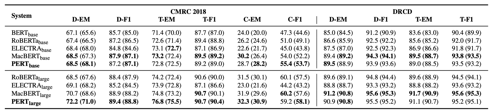
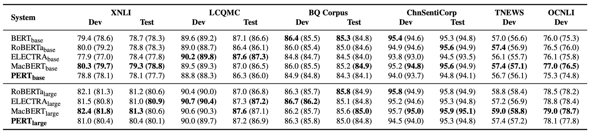
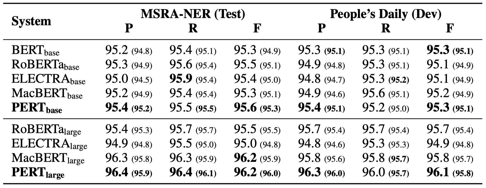
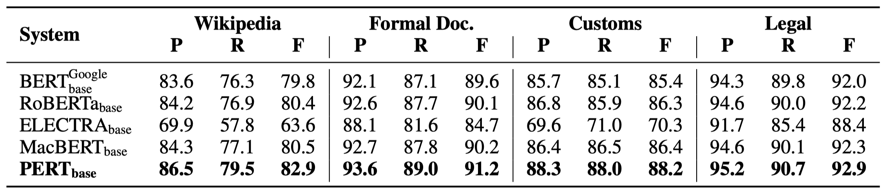
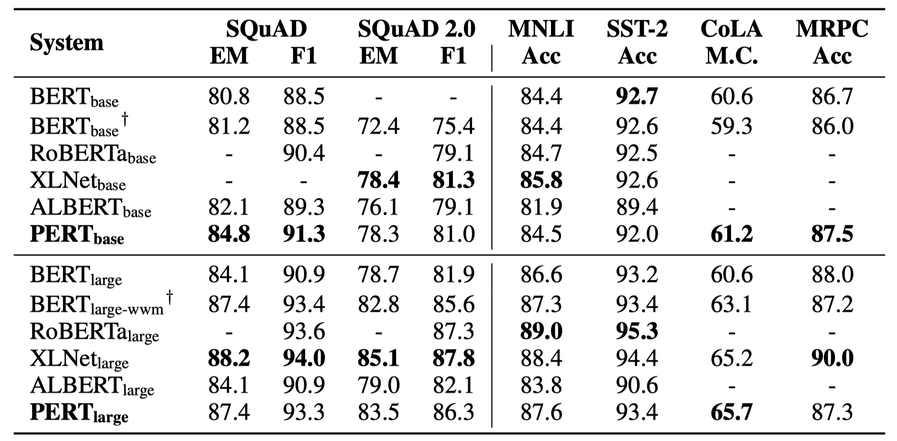

[**中文**](https://github.com/ymcui/PERT) | [**English**](https://github.com/ymcui/PERT/blob/main/README_EN.md)

<p align="center">
    <br>
    
    <br>
</p>
<p align="center">
    <a href="https://github.com/ymcui/PERT/blob/master/LICENSE">
        
    </a>
</p>
Pre-trained language models (PLMs) have become an important technique in natural language processing. In the past two years, the Joint Laboratory of HIT and iFLYTEK Research (HFL) has released a variety of Chinese pre-training model resources and related toolkits. As a continuation of related work, in this project, we propose a pre-trained model (PERT) based on permuted language model (PerLM) to learn text semantic information in a self-supervised manner without introducing the mask tokens [MASK]. The experimental results show that PERT yields both positive and negative performance on a wide range of Chinese and English NLU tasks. We release Chinese and English PERT (base-level and large-level) to our community.


- [**PERT: Pre-Training BERT with Permuted Language Model**](https://arxiv.org/abs/2203.06906)
- *Yiming Cui, Ziqing Yang, Ting Liu*

----

[Chinese MacBERT](https://github.com/ymcui/MacBERT) | [Chinese ELECTRA](https://github.com/ymcui/Chinese-ELECTRA) | [Chinese XLNet](https://github.com/ymcui/Chinese-XLNet) | [Chinese BERT](https://github.com/ymcui/Chinese-BERT-wwm) | [TextBrewer](https://github.com/airaria/TextBrewer) | [TextPruner](https://github.com/airaria/TextPruner)

View more resources released by HFL: https://github.com/ymcui/HFL-Anthology

## News
**2022/3/15 Our preliminary technical report is available on arXiv: https://arxiv.org/abs/2203.06906**

2022/2/24 Chinese and English PERT-base and PERT-large have been released. The BERT structure can be directly loaded and fine-tuned for downstream tasks. The technical report will be issued after it is perfected. The time is expected to be in mid-March. Thank you for your patience. 

2022/2/17 Thank you for your attention to this project. It is expected that the model will be issued next week, and the technical report will be issued after it is improved.

## Table of Contents
| Chapter                                       | Description                                                  |
| --------------------------------------------- | ------------------------------------------------------------ |
| [Introduction](#Introduction)                 | The basic principle of PERT                                  |
| [Download](#Download)                         | Download pre-trained PERT                                    |
| [QuickLoad](#QuickLoad)                       | How to use [🤗Transformers](https://github.com/huggingface/transformers) to quickly load models |
| [Baseline Performance](#Baseline-Performance) | Baseline system performances on some NLU tasks               |
| [FAQ](#FAQ)                                   | Frequently Asked Questions                                   |
| [Citation](#Citation)                         | Technical report of this project                             |


## Introduction
The learning of pre-trained models for natural language understanding (NLU) falls broadly into two categories: input text with or without the masking token [MASK]. 

The main motivation of this work is quite interesting, which is based on a usual phenomenon: a certain degree of permuted text does not affect comprehension. So is it possible to learn semantic knowledge from the permuted text?

General idea: PERT utilizes permuted text as the input  (so no [MASK] tokens are introduced). The learning objective of PERT is to predict the location of the original token. Please take a look at the following example.


## Download

### Original Download (TF version)

The model weights of TensorFlow 1.15 are mainly provided here. For models in PyTorch or TensorFlow2, see the next section.

**The open source version only contains the weights of the Transformer part, which can be directly used for fine-tuning of downstream tasks. Also you can further pre-train this model with any pre-training objective as long as it uses traditional transformer architecture as the main body. For more instructions, see FAQ.**

* **`PERT-large`**: 24-layer, 1024-hidden, 16-heads, 330M parameters
* **`PERT-base`** 12-layer, 768-hidden, 12-heads, 110M parameters

| Model                            | Language |         Corpus          |                       Google Download                        | Baidu Disk Download                                          |
| :------------------------------- | :------: | :---------------------: | :----------------------------------------------------------: | ------------------------------------------------------------ |
| **Chinese-PERT-large**           | Chinese  | EXT data <sup>[1]</sup> | [TensorFlow](https://drive.google.com/file/d/1jAV2IbJEHErVpl6mPceLjSEQl6osQ0uk/view?usp=sharing) | [TensorFlow (password: e9hs)](https://pan.baidu.com/s/1MG44TRIgqV6m_StfB_yBqQ?pwd=e9hs) |
| **Chinese-PERT-base**            | Chinese  | EXT data <sup>[1]</sup> | [TensorFlow](https://drive.google.com/file/d/1_3TYwubupTfL-pgb2seqvF1qgD5SRGrz/view?usp=sharing) | [TensorFlow (password: rcsw)](https://pan.baidu.com/s/1yDHkYKmdaJkliTGHWQtdFA?pwd=rcsw) |
| **English-PERT-large** (uncased) | English  | WikiBooks<sup>[2]</sup> | [TensorFlow](https://drive.google.com/file/d/1WXpMTCqB9Cf0jXQPiNAsyssTRDtPCHjU/view?usp=sharing) | [TensorFlow (password: wxwi)](https://pan.baidu.com/s/1h62V5y_XH6VqlD820KnkFw?pwd=wxwi) |
| **English-PERT-base** (uncased)  | English  | WikiBooks<sup>[2]</sup> | [TensorFlow](https://drive.google.com/file/d/1rJng61FlRveqXyHKXlxu1g9YTYi24N55/view?usp=sharing) | [TensorFlow (password: 8jgq)](https://pan.baidu.com/s/1fX4Epbgk8rR49A0xIAEWDw?pwd=8jgq) |

> [1] EXT data includes: Chinese Wikipedia, encyclopedias, news, question answering web, etc. The total number of words is 5.4B, taking about 20G of disk space, which is the same as MacBERT.
> [2] Wikipedia + BookCorpus

Take the TensorFlow version of `Chinese-PERT-base` as an example. The zip archive contains the following files:

````
chinese_pert_base_L-12_H-768_A-12.zip
    |- pert_model.ckpt # model weights
    |- pert_model.meta # model meta information
    |- pert_model.index # model index information
    |- pert_config.json # model parameters
    |- vocab.txt # Vocabulary (same as original vocabulary of Google's BERT-base-Chinese)
````

Among them, `bert_config.json` and `vocab.txt` are exactly the same as Google's original `BERT-base, Chinese` (the English version is the same as the BERT-uncased version).

### PyTorch and TensorFlow 2 version

TensorFlow (v2) and PyTorch version models can be downloaded through the 🤗transformers model library.

Download method: Click on any model to be downloaded → select the "Files and versions" tab → download the corresponding model file.

| Model                  | Model File Size |           Transformers ModelHub URL           |
| :--------------------- | :-------------: | :-------------------------------------------: |
| **Chinese-PERT-large** |      1.2G       | https://huggingface.co/hfl/chinese-pert-large |
| **Chinese-PERT-base**  |      0.4G       | https://huggingface.co/hfl/chinese-pert-base  |
| **English-PERT-large** |      1.2G       | https://huggingface.co/hfl/english-pert-large |
| **English-PERT-base**  |      0.4G       | https://huggingface.co/hfl/english-pert-base  |

## Quick Load
Since the main body of PERT is still the same as the BERT structure, users can easily call the PERT model using the [transformers library](https://github.com/huggingface/transformers).

**Note: All PERT models in this project should be loaded by using BertTokenizer and BertModel. **

````python
from transformers import BertTokenizer, BertModel

tokenizer = BertTokenizer.from_pretrained("MODEL_NAME")
model = BertModel.from_pretrained("MODEL_NAME")
````
The list of `MODEL_NAME` is as follows:

| Model name         | MODEL_NAME             |
| ------------------ | ---------------------- |
| Chinese-PERT-large | hfl/chinese-pert-large |
| Chinese-PERT-base  | hfl/chinese-pert-base  |
| English-PERT-large | hfl/english-pert-large |
| English-PERT-base  | hfl/english-pert-base  |

## Baseline Performance
For detailed performance, please see: https://arxiv.org/abs/2203.06906

We report both average score (in brackets) and maximum.

### Chinese Tasks

We perform experiments on the following ten Chinese tasks.

- **Machine Reading Comprehension** (2)：[CMRC 2018 (Simplified Chinese)](https://github.com/ymcui/cmrc2018)、[DRCD (Traditional Chinese)](https://github.com/DRCKnowledgeTeam/DRCD)
- **Text Classification** (6)：
  - **Single Sentence** (2)：[ChnSentiCorp](https://github.com/pengming617/bert_classification)、[TNEWS](https://github.com/CLUEbenchmark/CLUE)
  - **Sentence Pair** (4)：[XNLI](https://github.com/google-research/bert/blob/master/multilingual.md)、[LCQMC](http://icrc.hitsz.edu.cn/info/1037/1146.htm)、[BQ Corpus](http://icrc.hitsz.edu.cn/Article/show/175.html)、[OCNLI](https://github.com/CLUEbenchmark/OCNLI)
- **Named Entity Recognition (NER)** (2)：[MSRA-NER]()、[People's Daily (人民日报)]()

#### Machine Reading Comprehension



#### Text Classification



#### Named Entity Recognition



#### Text Correction (word order recovery)

Besides, we also carried out experiments on the word order recovery task, which is a part of the text correction.



### English Tasks

We perform experiments on the following six English tasks.

- **Machine Reading Comprehension** (2)：[SQuAD 1.1](https://rajpurkar.github.io/SQuAD-explorer/)、[SQuAD 2.0](https://rajpurkar.github.io/SQuAD-explorer/)
- **GLUE Tasks** (4)：[MNLI、SST-2、CoLA、MRPC](http://gluebenchmark.com)




## FAQ
**Q1: About the open-source version of PERT**  
A1: The open source version only contains the weights of the Transformer part, which can be directly used for fine-tuning of downstream tasks, or for the initialization of re-pre-training for other models. The original TF version weights may contain **randomly initialized** MLM weights (Please do not try to use these part). There are two reasons:

- To remove unnecessary Adam-related weights (the model size will be shrinked to its 1/3);
- Consistent with the BERT model conversion of transformers (this process will use the original BERT structure, so the weights of the pre-training task part will be lost, and the MLM random initialization weights of BERT will be retained).

**Q2: About the effect of PERT on downstream tasks**  
A2: The preliminary conclusion is that the effect is better in tasks such as reading comprehension and sequence labeling, but the effect is poor in text classification tasks. Please try the specific effects on your own tasks. For more information, please read our paper: https://arxiv.org/abs/2203.06906

## Citation

Please cite our paper if you find the resource or model useful. https://arxiv.org/abs/2203.06906

````tex
@article{cui2022pert,
      title={PERT: Pre-training BERT with Permuted Language Model}, 
      author={Cui, Yiming and Yang, Ziqing and Liu, Ting},
      year={2022},
      eprint={2203.06906},
      archivePrefix={arXiv},
      primaryClass={cs.CL}
}
````


## Follow us
Follow our official WeChat account to keep updated with our latest technologies!


## Feedback
If you have questions, please submit them in a GitHub Issue.

- **You are advised to read [FAQ](#FAQ) first before you submit an issue.** 
- Repetitive and irrelevant issues will be ignored and closed by [stable-bot](stale · GitHub Marketplace). Thank you for your understanding and support.
- We cannot acommodate EVERY request, and thus please bare in mind that there is no guarantee that your request will be met.
- Always be polite when you submit an issue.
